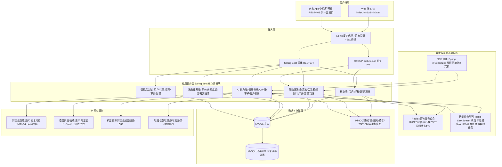

# MOYO-chat 创新功能产品设计方案

> 本方案基于现有代码库真实技术栈延伸设计（Spring Boot 3.0.2 / Java 17 / MyBatis-Plus 3.5.7 显式 Mapper / MySQL 5.7+ / Redis / MinIO / STOMP+SockJS / openai-java 对接阿里云百炼），
> 表结构延用现有 `schema.sql` 规范：表名 snake_case 单数、`id BIGINT AUTO_INCREMENT`、`create_time DATETIME DEFAULT CURRENT_TIMESTAMP`、布尔用 `TINYINT(1)`、枚举用 `VARCHAR+COMMENT` 而非 MySQL ENUM、`InnoDB + utf8mb4`。
> 21 项用户功能编号沿用需求文档（① ~ ㉑），管理员功能按模块编号。

---

## 一、系统架构图（文字描述）



**关键设计取舍（贴合现状，不过度设计）：**

1. **仍是单体应用**，按"域"做包级/模块级划分（`domain.game` / `domain.ai` / `domain.admin` 等），不引入微服务——现有团队规模与 QPS 量级下微服务只会增加运维成本。当单表数据量 > 5000 万行或团队 > 15 人时再考虑拆分（消息域、AI 域优先拆）。
2. **不引入 Kafka/RabbitMQ**：现有栈已有 Redis，用 `Redis List`（简单任务）+ `Redis Stream`（需要消费组、失败重试的任务，如 AI 审核、年度报告生成）做轻量任务队列即可满足 MVP 及未来 1-2 年量级，避免过早引入重中间件。
3. **实时能力统一走现有 STOMP `/topic/**`**：涂鸦画布、身份局、消息炸弹、位置共享、打字竞速全部复用同一套 WebSocket 通道，只是新增 destination 前缀，不新建协议，降低连接数与运维复杂度。
4. **必须解决的现存短板**：`TokenStore` 目前是 `ConcurrentHashMap` 内存存储（代码注释已自述"重启即失效，生产应替换"）。本方案功能量级扩大后用户会话、房间状态都会依赖"可靠的用户身份"，**这是 P0 级别必须先修的地基**，详见第七节风险评估。

---

## 二、数据库核心表设计

### 2.1 现有表复用与扩展（不重建，`ALTER TABLE` 增量）

| 表 | 新增字段 | 用途 |
|---|---|---|
| `user` | `vip_level TINYINT DEFAULT 0`、`last_login_ip VARCHAR(64)`、`last_login_device VARCHAR(255)`、`last_login_time DATETIME` | 支撑用户详情页、登录审计 |
| `message` | `edited TINYINT(1) DEFAULT 0`、`edited_time DATETIME`、`edit_hidden TINYINT(1) DEFAULT 0`、`bomb_deadline DATETIME`、`bomb_status VARCHAR(16)`、`voice_effect VARCHAR(16)`、`voice_emotion VARCHAR(16)`、`voice_translated TEXT`、`voice_origin_lang VARCHAR(8)`、`deliver_at DATETIME`、`distance_km INT`、`speed_mode VARCHAR(16) DEFAULT 'NORMAL'` | 消息改写④/消息炸弹⑨/语音⑮/物理延迟⑳ 共用消息主表，避免大量 JOIN |
| `friendship` | `intimacy_level TINYINT DEFAULT 1` | 亲密度等级冗余字段，减少高频查询 JOIN（明细见 `intimacy` 表） |

> 设计原则：**凡是"1条消息附带的状态"（改写/炸弹/语音效果/延迟送达）都挂在 `message` 表加字段，不拆表**——因为这些属性和消息是 1:1 关系，拆表只会带来更多 JOIN；**凡是"独立生命周期的实体"（时间胶囊、涂鸦房间、身份局）才建新表**。

### 2.2 新增核心表（按功能分组，完整 DDL）

```sql
-- ========== 通用用户设置（隐身阅读③ / 单向玻璃㉑ / 环境主题⑱ 等开关型配置聚合，避免表膨胀）==========
CREATE TABLE user_setting (
    id                BIGINT      NOT NULL AUTO_INCREMENT,
    user_id           BIGINT      NOT NULL,
    ghost_read        TINYINT(1)  NOT NULL DEFAULT 0 COMMENT '隐身阅读：1=开启，已读不推送回执',
    auto_theme        TINYINT(1)  NOT NULL DEFAULT 0 COMMENT '环境感知主题：1=按天气/时间自动切换',
    city_code         VARCHAR(16) DEFAULT NULL COMMENT '常驻城市编码，驱动同城专属主题/表情包',
    glass_mode_paid   TINYINT(1)  NOT NULL DEFAULT 0 COMMENT '是否已付费购买单向玻璃模式资格',
    speed_delivery_mode VARCHAR(16) NOT NULL DEFAULT 'NORMAL' COMMENT 'NORMAL=物理延迟 / INSTANT=付费即时',
    update_time       DATETIME    DEFAULT CURRENT_TIMESTAMP ON UPDATE CURRENT_TIMESTAMP,
    PRIMARY KEY (id),
    UNIQUE KEY uk_user_setting_user (user_id)
) ENGINE=InnoDB DEFAULT CHARSET=utf8mb4;

-- ========== ① 时间胶囊 ==========
CREATE TABLE time_capsule (
    id          BIGINT       NOT NULL AUTO_INCREMENT,
    sender_id   BIGINT       NOT NULL,
    receiver_id BIGINT       DEFAULT NULL COMMENT 'NULL=写给未来的自己',
    content_enc TEXT         NOT NULL COMMENT 'AES-256-GCM 加密后的正文（密文 Base64）',
    media_urls  TEXT         COMMENT 'JSON 数组，MinIO 图片/语音 URL（同样加密存储对象）',
    open_time   DATETIME     NOT NULL COMMENT '精确到日的开启日期，如 2027-01-01 00:00:00',
    status      VARCHAR(16)  NOT NULL DEFAULT 'SEALED' COMMENT 'SEALED=封存中 / UNLOCKED=已解锁',
    unlocked_time DATETIME   DEFAULT NULL,
    create_time DATETIME     DEFAULT CURRENT_TIMESTAMP,
    PRIMARY KEY (id),
    KEY idx_capsule_open (status, open_time),
    KEY idx_capsule_receiver (receiver_id)
) ENGINE=InnoDB DEFAULT CHARSET=utf8mb4;

-- 漂流瓶（时间胶囊的匿名随机投放变体，生命周期与权限模型差异较大，独立建表）
CREATE TABLE drift_bottle (
    id          BIGINT       NOT NULL AUTO_INCREMENT,
    sender_id   BIGINT       NOT NULL,
    content_enc TEXT         NOT NULL,
    media_urls  TEXT,
    status      VARCHAR(16)  NOT NULL DEFAULT 'FLOATING' COMMENT 'FLOATING=漂流中 / PICKED=已被捞取 / RETURNED=过期退回发送者',
    picked_by   BIGINT       DEFAULT NULL,
    picked_time DATETIME     DEFAULT NULL,
    float_days  INT          NOT NULL DEFAULT 7 COMMENT '发送时设定的漂流天数，到期未捞取自动退回',
    expire_time DATETIME     NOT NULL COMMENT 'create_time + float_days，定时任务据此扫描回收',
    create_time DATETIME     DEFAULT CURRENT_TIMESTAMP,
    PRIMARY KEY (id),
    KEY idx_bottle_status_expire (status, expire_time)
) ENGINE=InnoDB DEFAULT CHARSET=utf8mb4;

-- ========== ② 聊天情绪分析 / 年度报告 ==========
-- 按"会话粒度+天"聚合，避免年度报告生成时全表扫描 message
CREATE TABLE chat_mood_daily (
    id             BIGINT      NOT NULL AUTO_INCREMENT,
    user_id        BIGINT      NOT NULL,
    peer_key       VARCHAR(32) NOT NULL COMMENT '会话标识：USER:好友id 或 GROUP:群id',
    stat_date      DATE        NOT NULL,
    mood_score     DECIMAL(4,1) NOT NULL COMMENT '-100~100，负=负面情绪偏多，正=正面',
    dominant_emotion VARCHAR(16) NOT NULL COMMENT 'HAPPY/ANGRY/COLD/INTIMATE/NEUTRAL',
    msg_count      INT         NOT NULL DEFAULT 0,
    create_time    DATETIME    DEFAULT CURRENT_TIMESTAMP,
    PRIMARY KEY (id),
    UNIQUE KEY uk_mood_daily (user_id, peer_key, stat_date)
) ENGINE=InnoDB DEFAULT CHARSET=utf8mb4;

CREATE TABLE chat_annual_report (
    id            BIGINT      NOT NULL AUTO_INCREMENT,
    user_id       BIGINT      NOT NULL,
    year          INT         NOT NULL,
    report_json   MEDIUMTEXT  NOT NULL COMMENT '结构化报告：最佳一天/常用词TOP20/熬夜榜/表情包榜/总字数等',
    share_image_url VARCHAR(512) DEFAULT NULL COMMENT '生成的可分享长图，MinIO 地址',
    status        VARCHAR(16) NOT NULL DEFAULT 'GENERATING' COMMENT 'GENERATING/DONE/FAILED',
    create_time   DATETIME    DEFAULT CURRENT_TIMESTAMP,
    PRIMARY KEY (id),
    UNIQUE KEY uk_annual_report (user_id, year)
) ENGINE=InnoDB DEFAULT CHARSET=utf8mb4;

-- ========== ④ 消息改写历史（保留原始版本） ==========
CREATE TABLE message_edit_history (
    id          BIGINT      NOT NULL AUTO_INCREMENT,
    message_id  BIGINT      NOT NULL,
    content     TEXT        NOT NULL COMMENT '该次编辑前的历史内容（含最初原文，version=0）',
    version     INT         NOT NULL DEFAULT 0,
    edited_time DATETIME    DEFAULT CURRENT_TIMESTAMP,
    PRIMARY KEY (id),
    KEY idx_edit_history_msg (message_id)
) ENGINE=InnoDB DEFAULT CHARSET=utf8mb4;

-- ========== ⑤ AI 聊天分身 ==========
CREATE TABLE ai_persona (
    id              BIGINT      NOT NULL AUTO_INCREMENT,
    owner_id        BIGINT      NOT NULL COMMENT '分身所属真实用户',
    enabled         TINYINT(1)  NOT NULL DEFAULT 0 COMMENT '总开关：0=关闭 1=开启代回复',
    training_status VARCHAR(16) NOT NULL DEFAULT 'NONE' COMMENT 'NONE/QUEUED/TRAINING/READY/FAILED',
    sample_count    INT         NOT NULL DEFAULT 0 COMMENT '训练采样的历史消息条数',
    style_profile   MEDIUMTEXT  COMMENT 'AI 提炼出的说话风格摘要（供 Prompt 拼装，而非真正的模型权重微调，见技术选型说明）',
    last_trained_time DATETIME  DEFAULT NULL,
    create_time     DATETIME    DEFAULT CURRENT_TIMESTAMP,
    PRIMARY KEY (id),
    UNIQUE KEY uk_persona_owner (owner_id)
) ENGINE=InnoDB DEFAULT CHARSET=utf8mb4;

CREATE TABLE ai_persona_contact (
    id          BIGINT      NOT NULL AUTO_INCREMENT,
    persona_id  BIGINT      NOT NULL,
    contact_id  BIGINT      NOT NULL COMMENT '白名单联系人：仅对其自动代回复',
    create_time DATETIME    DEFAULT CURRENT_TIMESTAMP,
    PRIMARY KEY (id),
    UNIQUE KEY uk_persona_contact (persona_id, contact_id)
) ENGINE=InnoDB DEFAULT CHARSET=utf8mb4;

CREATE TABLE ai_persona_takeover_log (
    id           BIGINT     NOT NULL AUTO_INCREMENT,
    persona_id   BIGINT     NOT NULL,
    message_id   BIGINT     NOT NULL COMMENT '由分身代发的那条消息 id',
    takeover_time DATETIME  DEFAULT NULL COMMENT '本人接管（打断分身）的时间，NULL=未接管',
    create_time  DATETIME   DEFAULT CURRENT_TIMESTAMP,
    PRIMARY KEY (id),
    KEY idx_takeover_persona (persona_id)
) ENGINE=InnoDB DEFAULT CHARSET=utf8mb4;

-- ========== ⑥ 真心话轮盘 / 秘密交换 ==========
CREATE TABLE truth_round (
    id              BIGINT      NOT NULL AUTO_INCREMENT,
    group_id        BIGINT      NOT NULL,
    target_user_id  BIGINT      NOT NULL COMMENT '被随机抽中回答问题的人',
    status          VARCHAR(16) NOT NULL DEFAULT 'ASKING' COMMENT 'ASKING=提问中 / ANSWERING / REVEALED / CLOSED',
    question_limit  INT         NOT NULL DEFAULT 5 COMMENT '本局最多收多少个问题',
    create_time     DATETIME    DEFAULT CURRENT_TIMESTAMP,
    closed_time     DATETIME    DEFAULT NULL,
    PRIMARY KEY (id),
    KEY idx_truth_round_group (group_id, status)
) ENGINE=InnoDB DEFAULT CHARSET=utf8mb4;

CREATE TABLE truth_question (
    id          BIGINT      NOT NULL AUTO_INCREMENT,
    round_id    BIGINT      NOT NULL,
    asker_id    BIGINT      NOT NULL COMMENT '提问者真实 id，answered 前对其他成员匿名',
    content     VARCHAR(500) NOT NULL,
    answer      VARCHAR(1000) DEFAULT NULL,
    answered    TINYINT(1)  NOT NULL DEFAULT 0,
    revealed    TINYINT(1)  NOT NULL DEFAULT 0 COMMENT '回答后是否已揭晓提问者身份',
    create_time DATETIME    DEFAULT CURRENT_TIMESTAMP,
    PRIMARY KEY (id),
    KEY idx_truth_q_round (round_id)
) ENGINE=InnoDB DEFAULT CHARSET=utf8mb4;

CREATE TABLE secret_exchange (
    id          BIGINT      NOT NULL AUTO_INCREMENT,
    user_a      BIGINT      NOT NULL,
    user_b      BIGINT      NOT NULL,
    content_a   VARCHAR(500) DEFAULT NULL,
    content_b   VARCHAR(500) DEFAULT NULL,
    status      VARCHAR(16) NOT NULL DEFAULT 'WAITING' COMMENT 'WAITING=等待双方提交 / EXCHANGED=已互换可见 / EXPIRED',
    expire_time DATETIME    NOT NULL COMMENT '默认发起后 10 分钟未双填即过期',
    create_time DATETIME    DEFAULT CURRENT_TIMESTAMP,
    PRIMARY KEY (id),
    KEY idx_secret_status (status, expire_time)
) ENGINE=InnoDB DEFAULT CHARSET=utf8mb4;

-- ========== ⑦ 协同涂鸦 ==========
CREATE TABLE canvas_room (
    id              BIGINT      NOT NULL AUTO_INCREMENT,
    group_id        BIGINT      NOT NULL,
    mode            VARCHAR(16) NOT NULL DEFAULT 'FREE' COMMENT 'FREE=自由共绘 / GUESS=你画我猜 / RELAY=接力画',
    status          VARCHAR(16) NOT NULL DEFAULT 'ACTIVE' COMMENT 'ACTIVE/FINISHED',
    current_word    VARCHAR(32) DEFAULT NULL COMMENT 'GUESS 模式的当前题目词',
    current_drawer_id BIGINT    DEFAULT NULL,
    round_deadline  DATETIME    DEFAULT NULL COMMENT 'GUESS/RELAY 每轮限时',
    snapshot_url    VARCHAR(512) DEFAULT NULL COMMENT '最终成品快照（MinIO），供转发为聊天消息',
    create_time     DATETIME    DEFAULT CURRENT_TIMESTAMP,
    PRIMARY KEY (id),
    KEY idx_canvas_group (group_id, status)
) ENGINE=InnoDB DEFAULT CHARSET=utf8mb4;

CREATE TABLE canvas_relay_segment (
    id          BIGINT      NOT NULL AUTO_INCREMENT,
    room_id     BIGINT      NOT NULL,
    user_id     BIGINT      NOT NULL,
    seq         INT         NOT NULL COMMENT '第几笔（接力画每人限画一笔的顺序）',
    stroke_json MEDIUMTEXT  NOT NULL COMMENT '该笔的矢量路径数据（点集+颜色+粗细），不存位图',
    create_time DATETIME    DEFAULT CURRENT_TIMESTAMP,
    PRIMARY KEY (id),
    UNIQUE KEY uk_relay_seq (room_id, seq)
) ENGINE=InnoDB DEFAULT CHARSET=utf8mb4;
-- 说明：FREE/GUESS 模式的实时笔画只走 WebSocket 广播 + 内存/Redis 暂存，不逐笔落库，
-- 仅在"结束/转发"时把画布渲染结果截图存 MinIO（snapshot_url），避免海量小数据写库。

-- ========== ⑧ 群聊身份局 ==========
CREATE TABLE identity_game (
    id           BIGINT      NOT NULL AUTO_INCREMENT,
    group_id     BIGINT      NOT NULL,
    status       VARCHAR(16) NOT NULL DEFAULT 'RUNNING' COMMENT 'RUNNING/FINISHED/CANCELLED',
    template     VARCHAR(32) NOT NULL DEFAULT 'CLASSIC' COMMENT '身份局模板：CLASSIC(狼人/平民/预言家)/CUSTOM',
    duration_minutes INT      NOT NULL DEFAULT 30 COMMENT '一局默认持续时长，到时强制结算',
    mvp_user_id  BIGINT      DEFAULT NULL,
    create_time  DATETIME    DEFAULT CURRENT_TIMESTAMP,
    finished_time DATETIME   DEFAULT NULL,
    PRIMARY KEY (id),
    KEY idx_identity_group (group_id, status)
) ENGINE=InnoDB DEFAULT CHARSET=utf8mb4;

CREATE TABLE identity_game_player (
    id           BIGINT      NOT NULL AUTO_INCREMENT,
    game_id      BIGINT      NOT NULL,
    user_id      BIGINT      NOT NULL,
    role         VARCHAR(16) NOT NULL COMMENT 'WOLF/VILLAGER/SEER/SPECIAL 等，结束前对本人外不可见',
    task         VARCHAR(255) NOT NULL COMMENT '隐藏任务描述，如"引导某人说出关键词『菠萝』"',
    task_done    TINYINT(1)  NOT NULL DEFAULT 0,
    score        INT         NOT NULL DEFAULT 0 COMMENT '用于评选 MVP',
    create_time  DATETIME    DEFAULT CURRENT_TIMESTAMP,
    PRIMARY KEY (id),
    UNIQUE KEY uk_identity_player (game_id, user_id)
) ENGINE=InnoDB DEFAULT CHARSET=utf8mb4;

-- ========== ⑨ 消息炸弹（连锁信记录；单条炸弹状态复用 message.bomb_status/bomb_deadline）==========
CREATE TABLE bomb_chain (
    id              BIGINT      NOT NULL AUTO_INCREMENT,
    origin_message_id BIGINT   NOT NULL COMMENT '最初发起炸弹的消息 id',
    group_id        BIGINT      NOT NULL,
    current_holder_id BIGINT   NOT NULL COMMENT '当前"接盘"责任人',
    forward_path    TEXT        NOT NULL COMMENT 'JSON 数组，记录转发链路 [{userId,time}]',
    round_deadline  DATETIME    NOT NULL,
    status          VARCHAR(16) NOT NULL DEFAULT 'ACTIVE' COMMENT 'ACTIVE/RESOLVED(有人接盘回复)/EXHAUSTED(群成员轮完仍无人接盘)',
    create_time     DATETIME    DEFAULT CURRENT_TIMESTAMP,
    PRIMARY KEY (id),
    KEY idx_bomb_chain_status (status, round_deadline)
) ENGINE=InnoDB DEFAULT CHARSET=utf8mb4;

-- ========== ⑩ 实时位置拼团（实时坐标走 Redis GEO，此表只存"局"的元数据与结果） ==========
CREATE TABLE location_session (
    id              BIGINT      NOT NULL AUTO_INCREMENT,
    group_id        BIGINT      NOT NULL,
    status          VARCHAR(16) NOT NULL DEFAULT 'ACTIVE' COMMENT 'ACTIVE/ENDED',
    center_lat      DECIMAL(10,6) DEFAULT NULL COMMENT '计算得出的全员中心点',
    center_lng      DECIMAL(10,6) DEFAULT NULL,
    recommend_poi   VARCHAR(255) DEFAULT NULL COMMENT '推荐聚会地点（调用地图 POI 搜索得到）',
    expire_time     DATETIME    NOT NULL COMMENT '默认发起后 4 小时自动结束',
    create_time     DATETIME    DEFAULT CURRENT_TIMESTAMP,
    PRIMARY KEY (id),
    KEY idx_location_group (group_id, status)
) ENGINE=InnoDB DEFAULT CHARSET=utf8mb4;

-- ========== ⑪ 聊天挖矿 + 亲密度 ==========
CREATE TABLE user_points (
    id           BIGINT     NOT NULL AUTO_INCREMENT,
    user_id      BIGINT     NOT NULL,
    points       BIGINT     NOT NULL DEFAULT 0,
    level        TINYINT    NOT NULL DEFAULT 1,
    update_time  DATETIME   DEFAULT CURRENT_TIMESTAMP ON UPDATE CURRENT_TIMESTAMP,
    PRIMARY KEY (id),
    UNIQUE KEY uk_points_user (user_id)
) ENGINE=InnoDB DEFAULT CHARSET=utf8mb4;

CREATE TABLE points_log (
    id          BIGINT      NOT NULL AUTO_INCREMENT,
    user_id     BIGINT      NOT NULL,
    change_val  INT         NOT NULL COMMENT '正=获得，负=消耗',
    reason      VARCHAR(32) NOT NULL COMMENT 'CHAT_DURATION/MESSAGE_SEND/UNLOCK_THEME/HIDE_EDIT_MARK 等',
    ref_id      BIGINT      DEFAULT NULL,
    create_time DATETIME    DEFAULT CURRENT_TIMESTAMP,
    PRIMARY KEY (id),
    KEY idx_points_log_user (user_id, create_time)
) ENGINE=InnoDB DEFAULT CHARSET=utf8mb4;

CREATE TABLE intimacy (
    id           BIGINT     NOT NULL AUTO_INCREMENT,
    user_a       BIGINT     NOT NULL COMMENT '较小的 user_id，配合 user_b 保证 (a,b) 唯一且不重复存反向对',
    user_b       BIGINT     NOT NULL,
    exp          INT        NOT NULL DEFAULT 0,
    level        TINYINT    NOT NULL DEFAULT 1 COMMENT '1~10 级，阈值见第三节',
    update_time  DATETIME   DEFAULT CURRENT_TIMESTAMP ON UPDATE CURRENT_TIMESTAMP,
    PRIMARY KEY (id),
    UNIQUE KEY uk_intimacy_pair (user_a, user_b)
) ENGINE=InnoDB DEFAULT CHARSET=utf8mb4;

-- ========== ⑬ 限时匹配房间 ==========
CREATE TABLE match_room (
    id           BIGINT      NOT NULL AUTO_INCREMENT,
    topic_tag    VARCHAR(32) NOT NULL COMMENT '话题标签，如 #考研 #猫奴 #夜聊',
    status       VARCHAR(16) NOT NULL DEFAULT 'OPEN' COMMENT 'OPEN=匹配中未满员 / ACTIVE=已开聊 / EXTENDED / CLOSED',
    max_members  TINYINT     NOT NULL DEFAULT 5,
    extend_count TINYINT     NOT NULL DEFAULT 0 COMMENT '已续房次数，上限 3',
    expire_time  DATETIME    NOT NULL,
    create_time  DATETIME    DEFAULT CURRENT_TIMESTAMP,
    PRIMARY KEY (id),
    KEY idx_match_room_status (status, expire_time)
) ENGINE=InnoDB DEFAULT CHARSET=utf8mb4;
-- 说明：房间"存在1小时后自动解散、记录永久删除"——故不建 match_room_message 落库表，
-- 房间内消息直接复用 message 表（target_type='MATCH_ROOM'），到期由定时任务物理 DELETE，
-- 满足"永久删除"的产品要求（不能只是软删）。

CREATE TABLE match_room_member (
    id          BIGINT      NOT NULL AUTO_INCREMENT,
    room_id     BIGINT      NOT NULL,
    user_id     BIGINT      NOT NULL,
    join_time   DATETIME    DEFAULT CURRENT_TIMESTAMP,
    PRIMARY KEY (id),
    UNIQUE KEY uk_match_member (room_id, user_id)
) ENGINE=InnoDB DEFAULT CHARSET=utf8mb4;

-- ========== ⑭ 表情包决斗 ==========
CREATE TABLE emoji_duel (
    id          BIGINT      NOT NULL AUTO_INCREMENT,
    user_a      BIGINT      NOT NULL,
    user_b      BIGINT      NOT NULL,
    mode        VARCHAR(16) NOT NULL DEFAULT '1V1' COMMENT '1V1 / TOURNAMENT',
    tournament_id BIGINT    DEFAULT NULL COMMENT '锦标赛模式关联的赛事 id（群内发起）',
    status      VARCHAR(16) NOT NULL DEFAULT 'ONGOING' COMMENT 'ONGOING/FINISHED',
    winner_id   BIGINT      DEFAULT NULL,
    create_time DATETIME    DEFAULT CURRENT_TIMESTAMP,
    PRIMARY KEY (id)
) ENGINE=InnoDB DEFAULT CHARSET=utf8mb4;

CREATE TABLE emoji_duel_round (
    id          BIGINT      NOT NULL AUTO_INCREMENT,
    duel_id     BIGINT      NOT NULL,
    user_id     BIGINT      NOT NULL,
    emoji_url   VARCHAR(512) NOT NULL,
    ai_score    DECIMAL(4,1) DEFAULT NULL COMMENT 'AI 综合评分 0~100',
    ai_comment  VARCHAR(255) DEFAULT NULL COMMENT 'AI 点评（应景度/梗浓度/创意分明细可存 JSON 到此字段）',
    create_time DATETIME    DEFAULT CURRENT_TIMESTAMP,
    PRIMARY KEY (id),
    KEY idx_duel_round (duel_id)
) ENGINE=InnoDB DEFAULT CHARSET=utf8mb4;

CREATE TABLE emoji_rank (
    id          BIGINT      NOT NULL AUTO_INCREMENT,
    user_id     BIGINT      NOT NULL,
    tier        VARCHAR(16) NOT NULL DEFAULT 'BRONZE' COMMENT 'BRONZE/SILVER/GOLD/PLATINUM/KING',
    win_streak  INT         NOT NULL DEFAULT 0,
    total_wins  INT         NOT NULL DEFAULT 0,
    total_duels INT         NOT NULL DEFAULT 0,
    update_time DATETIME    DEFAULT CURRENT_TIMESTAMP ON UPDATE CURRENT_TIMESTAMP,
    PRIMARY KEY (id),
    UNIQUE KEY uk_emoji_rank_user (user_id)
) ENGINE=InnoDB DEFAULT CHARSET=utf8mb4;

-- ========== ⑲ 打字速度竞赛（1v1 结果落库，实时排行榜用 Redis ZSET 每日重置） ==========
CREATE TABLE typing_race (
    id          BIGINT      NOT NULL AUTO_INCREMENT,
    user_a      BIGINT      NOT NULL,
    user_b      BIGINT      NOT NULL,
    wpm_a       INT         NOT NULL DEFAULT 0,
    wpm_b       INT         NOT NULL DEFAULT 0,
    winner_id   BIGINT      DEFAULT NULL,
    create_time DATETIME    DEFAULT CURRENT_TIMESTAMP,
    PRIMARY KEY (id)
) ENGINE=InnoDB DEFAULT CHARSET=utf8mb4;

-- ========== ㉑ 单向玻璃模式授权 ==========
CREATE TABLE glass_mode_grant (
    id           BIGINT     NOT NULL AUTO_INCREMENT,
    grantor_id   BIGINT     NOT NULL COMMENT '被"看光"的一方（付费开通对某人透明的人）',
    grantee_id   BIGINT     NOT NULL COMMENT '获得可见权限的一方',
    mutual       TINYINT(1) NOT NULL DEFAULT 0 COMMENT '1=双方都开启，全透明模式',
    expire_time  DATETIME   NOT NULL COMMENT '按购买时长到期（如 30 天）',
    create_time  DATETIME   DEFAULT CURRENT_TIMESTAMP,
    PRIMARY KEY (id),
    UNIQUE KEY uk_glass_grant (grantor_id, grantee_id)
) ENGINE=InnoDB DEFAULT CHARSET=utf8mb4;

-- ========== 富媒体/离线包裹/环境主题 辅助表 ==========
CREATE TABLE link_preview_cache (
    id          BIGINT      NOT NULL AUTO_INCREMENT,
    url_hash    CHAR(32)    NOT NULL COMMENT 'md5(url)',
    title       VARCHAR(255),
    description VARCHAR(500),
    image_url   VARCHAR(512),
    source_type VARCHAR(16) NOT NULL COMMENT 'URL/MUSIC/MOVIE/BOOK/LOCATION',
    raw_json    TEXT        COMMENT '解析出的结构化卡片数据',
    update_time DATETIME    DEFAULT CURRENT_TIMESTAMP ON UPDATE CURRENT_TIMESTAMP,
    PRIMARY KEY (id),
    UNIQUE KEY uk_link_preview (url_hash)
) ENGINE=InnoDB DEFAULT CHARSET=utf8mb4;

CREATE TABLE theme_asset (
    id           BIGINT      NOT NULL AUTO_INCREMENT,
    name         VARCHAR(64) NOT NULL,
    `condition`  VARCHAR(32) NOT NULL COMMENT 'NIGHT/RAIN/SNOW/SAME_CITY/DEFAULT',
    resource_url VARCHAR(512) NOT NULL COMMENT '主题包 CSS/贴图资源地址',
    city_exclusive_code VARCHAR(16) DEFAULT NULL COMMENT '非空表示仅该城市用户可用',
    enabled      TINYINT(1)  NOT NULL DEFAULT 1,
    create_time  DATETIME    DEFAULT CURRENT_TIMESTAMP,
    PRIMARY KEY (id)
) ENGINE=InnoDB DEFAULT CHARSET=utf8mb4;
```

### 2.3 管理员体系新增表（完整 DDL）

```sql
-- 管理员角色分级：不改动现有 user.role='ADMIN' 的判定逻辑（兼容现有 assertAdmin），
-- 而是在其基础上"精细化"——role=ADMIN 只是"能登录 /admin"的大门，具体能操作什么由 admin_role 决定。
CREATE TABLE admin_role (
    id          INT         NOT NULL AUTO_INCREMENT,
    role_key    VARCHAR(32) NOT NULL COMMENT 'SUPER_ADMIN/SENIOR_ADMIN/REVIEWER/SUPPORT',
    role_name   VARCHAR(32) NOT NULL COMMENT '超级管理员/高级管理员/审核员/客服',
    level       TINYINT     NOT NULL COMMENT '1=超级 2=高级 3=审核员 4=客服，数字越小权限越大',
    create_time DATETIME    DEFAULT CURRENT_TIMESTAMP,
    PRIMARY KEY (id),
    UNIQUE KEY uk_admin_role_key (role_key)
) ENGINE=InnoDB DEFAULT CHARSET=utf8mb4;

CREATE TABLE admin_profile (
    id           BIGINT     NOT NULL AUTO_INCREMENT,
    user_id      BIGINT     NOT NULL COMMENT '关联 user 表（role=ADMIN 的账户）',
    admin_role_id INT       NOT NULL,
    ghost_login  TINYINT(1) NOT NULL DEFAULT 1 COMMENT '隐身登录：1=登录不显示在线状态',
    create_time  DATETIME   DEFAULT CURRENT_TIMESTAMP,
    PRIMARY KEY (id),
    UNIQUE KEY uk_admin_profile_user (user_id)
) ENGINE=InnoDB DEFAULT CHARSET=utf8mb4;

-- 权限矩阵明细：module(功能模块) + action(read/write/danger) 二维控制，见第四节权限矩阵表
CREATE TABLE admin_role_permission (
    id            BIGINT     NOT NULL AUTO_INCREMENT,
    admin_role_id INT        NOT NULL,
    module        VARCHAR(32) NOT NULL COMMENT 'USER_MGMT/CONTENT_AUDIT/FEATURE_CONFIG/GROUP_MGMT/STATS/SECURITY/AI_MGMT',
    action        VARCHAR(16) NOT NULL COMMENT 'READ/WRITE/DANGER（DANGER=封号/删号/强制解散等不可逆操作）',
    PRIMARY KEY (id),
    UNIQUE KEY uk_role_perm (admin_role_id, module, action)
) ENGINE=InnoDB DEFAULT CHARSET=utf8mb4;

-- 操作审计日志：只增不减，任何角色（含超级管理员）均不可删除/修改，通过应用层禁止 DELETE/UPDATE 语句实现
CREATE TABLE audit_log (
    id          BIGINT      NOT NULL AUTO_INCREMENT,
    admin_id    BIGINT      NOT NULL,
    action      VARCHAR(64) NOT NULL COMMENT '如 USER_BAN / MESSAGE_DELETE / POINTS_INJECT / IMPERSONATE',
    target_type VARCHAR(32) DEFAULT NULL COMMENT 'USER/MESSAGE/GROUP/MOMENT/ROOM 等',
    target_id   BIGINT      DEFAULT NULL,
    detail_json TEXT        COMMENT '操作前后差异快照，如封禁原因/积分变更数值',
    ip          VARCHAR(64) DEFAULT NULL,
    create_time DATETIME    DEFAULT CURRENT_TIMESTAMP,
    PRIMARY KEY (id),
    KEY idx_audit_admin (admin_id, create_time),
    KEY idx_audit_target (target_type, target_id)
) ENGINE=InnoDB DEFAULT CHARSET=utf8mb4;

-- 敏感词库（支持普通匹配 + 正则）
CREATE TABLE sensitive_word (
    id          BIGINT      NOT NULL AUTO_INCREMENT,
    word        VARCHAR(128) NOT NULL,
    category    VARCHAR(16) NOT NULL DEFAULT 'GENERAL' COMMENT 'PORN/VIOLENCE/POLITICS/AD/GENERAL',
    is_regex    TINYINT(1)  NOT NULL DEFAULT 0,
    enabled     TINYINT(1)  NOT NULL DEFAULT 1,
    create_time DATETIME    DEFAULT CURRENT_TIMESTAMP,
    PRIMARY KEY (id),
    KEY idx_sensitive_category (category, enabled)
) ENGINE=InnoDB DEFAULT CHARSET=utf8mb4;

-- 举报处理中心
CREATE TABLE report (
    id            BIGINT      NOT NULL AUTO_INCREMENT,
    reporter_id   BIGINT      NOT NULL,
    target_type   VARCHAR(16) NOT NULL COMMENT 'USER/MESSAGE/MOMENT/GROUP',
    target_id     BIGINT      NOT NULL,
    reason        VARCHAR(500) NOT NULL,
    evidence_urls TEXT        COMMENT 'JSON 数组，截图等证据',
    status        VARCHAR(16) NOT NULL DEFAULT 'PENDING' COMMENT 'PENDING/HANDLING/RESOLVED/REJECTED',
    handler_id    BIGINT      DEFAULT NULL,
    handle_result VARCHAR(500) DEFAULT NULL,
    handle_time   DATETIME    DEFAULT NULL,
    create_time   DATETIME    DEFAULT CURRENT_TIMESTAMP,
    PRIMARY KEY (id),
    KEY idx_report_status (status, create_time)
) ENGINE=InnoDB DEFAULT CHARSET=utf8mb4;

-- 功能灰度开关：21 项新功能 + 未来所有功能统一走这张表控制，不写死在代码
CREATE TABLE feature_flag (
    id              BIGINT      NOT NULL AUTO_INCREMENT,
    feature_key     VARCHAR(64) NOT NULL COMMENT '如 TIME_CAPSULE/DRIFT_BOTTLE/MESSAGE_BOMB',
    enabled         TINYINT(1)  NOT NULL DEFAULT 0,
    rollout_percent TINYINT     NOT NULL DEFAULT 100 COMMENT '灰度百分比 0~100，按 user_id 哈希分桶',
    rollout_group   VARCHAR(32) DEFAULT NULL COMMENT '指定用户组（如 VIP/内测名单），为空表示按百分比',
    updated_by      BIGINT      DEFAULT NULL,
    update_time     DATETIME    DEFAULT CURRENT_TIMESTAMP ON UPDATE CURRENT_TIMESTAMP,
    PRIMARY KEY (id),
    UNIQUE KEY uk_feature_key (feature_key)
) ENGINE=InnoDB DEFAULT CHARSET=utf8mb4;

-- 通用系统参数配置：积分速率/炸弹默认时长/房间人数等，避免硬编码，后台可调
CREATE TABLE system_config (
    id          BIGINT      NOT NULL AUTO_INCREMENT,
    config_key  VARCHAR(64) NOT NULL COMMENT '如 POINTS_PER_MESSAGE / BOMB_DEFAULT_SECONDS / ROOM_MAX_MEMBERS',
    config_value VARCHAR(255) NOT NULL,
    remark      VARCHAR(255) DEFAULT NULL,
    update_time DATETIME    DEFAULT CURRENT_TIMESTAMP ON UPDATE CURRENT_TIMESTAMP,
    PRIMARY KEY (id),
    UNIQUE KEY uk_config_key (config_key)
) ENGINE=InnoDB DEFAULT CHARSET=utf8mb4;

-- 登录日志（管理员 + 普通用户通用，type 区分）
CREATE TABLE login_log (
    id          BIGINT      NOT NULL AUTO_INCREMENT,
    user_id     BIGINT      NOT NULL,
    user_type   VARCHAR(8)  NOT NULL DEFAULT 'USER' COMMENT 'USER/ADMIN',
    ip          VARCHAR(64) NOT NULL,
    device      VARCHAR(255) DEFAULT NULL,
    result      VARCHAR(16) NOT NULL COMMENT 'SUCCESS/FAIL_PWD/FAIL_FROZEN/FAIL_RISK',
    risk_flag   TINYINT(1)  NOT NULL DEFAULT 0 COMMENT '1=异地/异常设备等风控标记为可疑',
    create_time DATETIME    DEFAULT CURRENT_TIMESTAMP,
    PRIMARY KEY (id),
    KEY idx_login_log_user (user_id, create_time)
) ENGINE=InnoDB DEFAULT CHARSET=utf8mb4;

-- 全局黑名单（IP/设备/手机号维度，独立于用户账号封禁）
CREATE TABLE blacklist (
    id          BIGINT      NOT NULL AUTO_INCREMENT,
    type        VARCHAR(16) NOT NULL COMMENT 'IP/DEVICE/PHONE/EMAIL',
    value       VARCHAR(128) NOT NULL,
    reason      VARCHAR(255) DEFAULT NULL,
    operator_id BIGINT      NOT NULL,
    create_time DATETIME    DEFAULT CURRENT_TIMESTAMP,
    PRIMARY KEY (id),
    UNIQUE KEY uk_blacklist (type, value)
) ENGINE=InnoDB DEFAULT CHARSET=utf8mb4;

-- 第三方 API 密钥管理
CREATE TABLE api_key (
    id          BIGINT      NOT NULL AUTO_INCREMENT,
    key_value   VARCHAR(64) NOT NULL COMMENT '实际下发的密钥（存储时建议再加一层 HMAC 摘要，不存明文）',
    owner_name  VARCHAR(64) NOT NULL COMMENT '接入方名称',
    scopes      VARCHAR(255) NOT NULL COMMENT '逗号分隔的授权范围，如 message:read,user:read',
    status      VARCHAR(16) NOT NULL DEFAULT 'ACTIVE' COMMENT 'ACTIVE/REVOKED',
    created_by  BIGINT      NOT NULL,
    create_time DATETIME    DEFAULT CURRENT_TIMESTAMP,
    revoked_time DATETIME   DEFAULT NULL,
    PRIMARY KEY (id),
    UNIQUE KEY uk_api_key (key_value)
) ENGINE=InnoDB DEFAULT CHARSET=utf8mb4;

-- 数据备份记录
CREATE TABLE backup_record (
    id          BIGINT      NOT NULL AUTO_INCREMENT,
    file_path   VARCHAR(512) NOT NULL COMMENT 'mysqldump 产出文件在对象存储的路径',
    size_bytes  BIGINT      NOT NULL DEFAULT 0,
    trigger_by  BIGINT      NOT NULL COMMENT '触发的管理员，NULL 表示系统定时任务',
    status      VARCHAR(16) NOT NULL DEFAULT 'SUCCESS' COMMENT 'SUCCESS/FAILED',
    create_time DATETIME    DEFAULT CURRENT_TIMESTAMP,
    PRIMARY KEY (id)
) ENGINE=InnoDB DEFAULT CHARSET=utf8mb4;
```

> 系统紧急模式（全站只读/关闭注册）不新建表，复用 `system_config`：`GLOBAL_READONLY=1`、`REGISTRATION_CLOSED=1`，`WebConfig` 拦截器读取该配置即可一键生效，改动面最小。
> 全站广播公告复用现有 `notice` 表（`target_type=ALL`），无需新建。

---

## 三、功能详细交互流程

> 格式统一为：**触发条件 → 处理逻辑（含关键参数）→ 反馈结果**。WS 目的地延续现有 `/app/**`（客户端发）与 `/topic/**`（服务端广播）约定。

### 个人向功能

**① 时间胶囊**
- 触发：用户在"程序空间"新增"时间胶囊"卡片，撰写内容、选收件人（含"写给自己"）、选开启日期。
- 处理：`POST /api/capsule/create`，正文用 AES-256-GCM 加密后存 `content_enc`（密钥来自 KMS 或应用级主密钥派生，见风险评估）；`Spring @Scheduled` 每小时扫描 `time_capsule WHERE status='SEALED' AND open_time<=NOW()`，命中后解密、写入 `notice`（category=`CAPSULE`，ref_id=胶囊 id）、按用户在线状态经 STOMP 推送或等待下次登录弹出。
- 反馈：收件人端点击通知 → 播放"拆信封" CSS/Lottie 动画（信封裂开+纸张滑出，约 1.2s）→ 展示解密后正文。
- 漂流瓶变体：`POST /api/bottle/throw` 写入 `drift_bottle(status=FLOATING)`；捞取用 `POST /api/bottle/pick`，逻辑为 `SELECT ... WHERE status='FLOATING' AND sender_id<>uid ORDER BY RAND() LIMIT 1 FOR UPDATE`（小表可接受 RAND()，日活增长后改为"预取候选池"避免全表扫描）；`float_days` 默认 7 天，定时任务超期未捞则 `status=RETURNED` 并通知发送者。

**② 聊天情绪分析 / 年度报告**
- 触发：用户主动进入"情绪分析"页，或每年 12 月 1 日系统批量触发年度报告生成任务。
- 处理：日增量任务（凌晨 2:00）按会话取当天新消息，调用大模型做**情绪分类 Prompt**（输出 `{score:-100~100, emotion:枚举}` 结构化 JSON，复用现有 `AiService.chat` 通道，system prompt 固定模板），写 `chat_mood_daily`；"关系最好的一天"= `mood_score` 最高的一天，附带取该天消息片段（脱敏后展示）。年度报告任务投递到 Redis Stream `stream:annual-report`，Worker 消费后统计词频（结巴分词/HanLP 简单分词即可，不需要重模型）、熬夜榜（23:00-5:00 消息计数）、表情包 TOP5、总字数，渲染为长图（后端用 `Java2D`/`Freemarker+HTML转图` 均可，MVP 用 HTML 模板 + 无头浏览器截图或 Canvas 前端渲染后上传更快）存 MinIO。
- 反馈：报告页展示曲线图（ECharts）+ 一键"生成分享图" + "保存到相册"。
- 关键参数：情绪分类置信度 < 0.6 时标记 `NEUTRAL`，不强行归类，避免"娱乐性分析"翻车引发用户反感。

**③ 隐身阅读**
- 触发：设置页开启 `user_setting.ghost_read=1`。
- 处理：`MessageController` 标记已读的接口 (`/api/message/read`) 检查发送方是否开启隐身；开启则**仍更新自身"已浏览"状态用于同步多端**，但不触发对已读回执 WebSocket 广播（`/topic/user/{peer}` 的 `READ_RECEIPT` 事件跳过发送），前端也不展示"对方已读"。
- 已读不回分析器（娱乐向）：对方超过设定时长（默认 2 小时）未回复时，调用 AI 以诙谐语气生成猜测文案（如"对方可能正在纠结怎么回你，也可能在打游戏"），**必须加免责声明"仅供娱乐"**，纯前端触发+单次 AI 调用，不落库。

**④ 消息改写**
- 触发：长按/右键自己已发送的消息选择"编辑"。
- 处理：`PUT /api/message/{id}/edit`；服务端先查 `message.read` 状态：
  - 未读：直接更新 `content`，同步写一条 `message_edit_history(version=0, content=原文)`，通过 WS 向接收方推送 `MESSAGE_UPDATED` 事件（接收方本地静默替换，不感知发生过修改）。
  - 已读：更新内容 + `edited=1, edited_time=NOW()`，接收方看到内容变化并显示"已编辑"角标；用户可消耗 **30 积分** 设置 `edit_hidden=1` 隐藏该角标（`points_log.reason=HIDE_EDIT_MARK`）。
  - 无论哪种情况，原始内容始终可在"我的编辑历史"里查看（仅本人可见）。
- 反馈：编辑成功 Toast + 消息气泡内容原地渐变替换（沿用现有 `.msg` 入场动画的淡入手法）。

**⑤ AI 聊天分身**
- 触发：用户在个人中心开启"AI 分身"，选择训练数据范围（默认最近 3 个月、最多 2000 条消息）。
- 处理：`POST /api/persona/train` 投递任务到 Redis Stream `stream:persona-train`；Worker 拉取历史消息，**不做参数微调（成本高、不可控）**，而是用大模型做"风格提炼"——输出说话习惯摘要（口头禅、句式长度、常用表情、话题偏好）存入 `style_profile`，`training_status=READY`。用户消息来自白名单联系人（`ai_persona_contact`）且分身 `enabled=1` 且用户本人处于离线/免打扰状态时，`ChatController` 检测命中后以 `style_profile` 作为 system prompt 补充，生成代回复，并落一条 `ai_persona_takeover_log`。
- 反馈：代回复消息气泡带"AI代"角标；本人任意时刻发送真实消息即视为"接管"（写 `takeover_time`），之后该会话本轮对话分身自动让位。
- 关键参数：单次代回复响应超时 8 秔 未返回则降级为不回复（避免用户等待）；分身单日代回复上限 50 条，防止滥用刷屏。

### 多人互动功能

**⑥ 匿名真心话轮盘 / 秘密交换**
- 触发：群内发送 `/app/truth.start`，服务端从 `group_member` 随机选一名在线成员为 `target_user_id`，写 `truth_round`。
- 处理：其余成员通过 `/app/truth.ask` 提问（写 `truth_question`，`asker_id` 对其他成员匿名，仅展示序号"匿名提问1"），累计达到 `question_limit`（默认 5）或倒计时 10 分钟到期后自动进入 `ANSWERING`；被抽中者必须逐条回答（前端强制展示"待回答"红点，可设置**超时 24 小时未回自动标记"已过期弃权"**，避免死锁整局）；每条回答后立即 `revealed=1` 并广播提问者真实身份。
- 反馈：`/topic/group/{id}` 广播 `TRUTH_QUESTION` / `TRUTH_ANSWERED` / `TRUTH_REVEALED` 事件，群消息流内以特殊卡片样式展示。
- 秘密交换：双人发起 `/app/secret.start`，各自 `/app/secret.submit` 提交内容到 `content_a/content_b`；服务端检测双方都非空后原子更新 `status=EXCHANGED` 并双向推送，10 分钟未双填自动 `EXPIRED` 并清空内容（不落库明文超过必要时间，降低隐私风险）。

**⑦ 协同涂鸦**
- 触发：群内点击"发起涂鸦"，选模式（自由/你画我猜/接力）。
- 处理：FREE/GUESS 模式下笔画数据通过 `/app/canvas.stroke` 高频（约 20-30 次/秒，前端节流到 15fps 发送）广播到 `/topic/canvas/{roomId}`，**不落库**，仅服务端内存/Redis 保留"当前画布最终状态的增量日志"（用于新加入者的画布同步，TTL=房间生命周期）；GUESS 模式额外维护 `current_word`（从词库随机取，默认词库 500 词，难度分级）与 60 秒倒计时，猜对者广播 `GUESS_CORRECT` 并计分；RELAY 模式每人限提交一次 `/app/canvas.relaySegment`（写 `canvas_relay_segment`，`seq` 严格递增，服务端用 `SELECT MAX(seq) FOR UPDATE` 防并发插入冲突），全员画完或达上限人数后合成终稿。
- 反馈：画布支持"转发为消息"→ 前端 Canvas 截图（`canvas.toBlob`）上传 MinIO，作为一条 `IMAGE` 消息发送到群聊，同时更新 `canvas_room.snapshot_url`。
- 关键参数：单房间同时在线绘画人数上限 12（超出仅可围观）；画布分辨率固定 800×600 降低同步与存储成本。

**⑧ 群聊身份局**
- 触发：群主/管理员发起 `/app/identity.start`，选模板与人数（建议 6-12 人）。
- 处理：服务端按模板比例分配角色（如 12 人局：2 狼人+8 平民+1 预言家+1 特殊角色）并为每人生成隐藏任务（任务库预置 30+ 条，按角色标签随机抽取，避免任务和角色冲突穿帮），仅通过 `/topic/user/{id}` 点对点私密下发本人角色和任务，群内正常聊天不受打断。任务完成判定为**关键词命中**（服务端对群消息做实时敏感词式匹配，命中即标记 `task_done=1` 加分）或**手动举证**（玩家截图向系统举证，人工/AI 快速判定）。`duration_minutes` 默认 30 分钟到时或群主提前 `/app/identity.end` 触发结算。
- 反馈：结算时广播 `IDENTITY_REVEAL` 事件，展示全员身份、任务完成情况、按 `score` 评出 MVP，生成一张"战报卡片"可发到群里。

**⑨ 消息炸弹**
- 触发：发送消息时勾选"炸弹"并选倒计时（30s/60s/5min 可选）。
- 处理：写入 `message.bomb_deadline`、`bomb_status=PENDING`；定时扫描任务（Redis 延迟队列更优：用 `ZADD bomb:queue {deadline} {messageId}`，Worker `ZRANGEBYSCORE` 轮询，避免频繁扫 MySQL）到期未收到接收方回复（`bomb_status` 仍为 `PENDING`）则置 `EXPLODED`，消息内容改为"💣 已炸"占位，并向发送方推送"对方被炸"通知。
- 连锁信变体：勾选"连锁"发到群聊，超时不是直接炸，而是写 `bomb_chain`，`current_holder_id` 轮转到群内下一位在线成员（按加群时间排序），刷新 `round_deadline`，直到轮完一整圈仍无人接盘才最终 `EXHAUSTED`。
- 反馈：消息气泡显示实时倒计时环形进度条（复用现有番茄钟 `.pomo-ring` 的 SVG 环形进度画法）。

**⑩ 实时位置拼团**
- 触发：群内发起 `/app/location.start`，成员依次 `/app/location.share`（前端 `navigator.geolocation.watchPosition`，默认 30 秒上报一次）。
- 处理：坐标写 `GEOADD loc:session:{id} lng lat userId`（Redis GEO），TTL 与 `location_session.expire_time` 一致（默认 4 小时）；中心点用简单质心算法（各点经纬度均值，人数 ≤ 20 时精度足够，不需要复杂的球面质心）；调用地图 POI 搜索 API 以中心点为圆心检索半径 1km 内评分最高的餐饮/娱乐场所作为推荐地点。"谁离我最近"用 `GEODIST` 实时查询。
- 反馈：地图组件展示所有成员头像标记 + 中心点 + 推荐地点卡片（含一键导航跳转高德/腾讯地图 App scheme）。
- 隐私前置：**必须每次发起时二次弹窗确认授权**，且任何一方可随时 `/app/location.stop` 退出且不可被强制拉入。

### 社交游戏化功能

**⑪ 聊天挖矿**
- 触发：正常聊天行为。
- 处理：消息发送成功后异步 `+2 分/条`（`points_log.reason=MESSAGE_SEND`），在线时长每 10 分钟结算 `+5 分`（心跳由前端 WS 保活间隔驱动，服务端记录 `last_active_time`），**每日积分获取上限 200 分**防刷；解锁项在 `points_shop`（可并入 `theme_asset`/表情包资源表加 `unlock_points` 字段）配置所需积分。双人亲密度：同一对好友互发消息 `exp+1`（每日同一对最多计 100 次防刷屏刷分），等级阈值：Lv1 0-99、Lv2 100-499、Lv3 500-1999、Lv4 2000-4999、Lv5 5000+，每级解锁专属气泡皮肤/称号。
- 反馈：个人中心积分明细列表 + 亲密度进度条（好友资料卡内展示）。

**⑫ 社交图谱**
- 触发：搜索"XX和我的关系"。
- 处理：以 `friendship(status=ACCEPTED)` 为边做 **BFS 最短路径**（好友关系图在千万级用户下仍可用 Redis 邻接表缓存 + 应用层 BFS，超过 4 度直接返回">4度，关系较远"而非继续搜索，控制查询成本）；"发现共同好友"= 双方好友列表取交集，SQL 层 `INNER JOIN` 即可。
- 反馈：Canvas/SVG 力导向图展示路径链条（如"你 → 张三 → 李四 → 目标"），点击节点跳转对方资料页（遵循隐私可见性设置）。

**⑬ 限时匹配房间**
- 触发：用户选话题标签发起匹配，`/api/room/match`。
- 处理：优先 `SELECT` 现有 `status='OPEN'` 且同标签、`member_count < max_members` 的房间加入；无合适房间则新建（`expire_time=NOW()+1小时`）。满 5 人自动 `status=ACTIVE`。到期前 5 分钟推送"是否续房"投票（简单多数同意即续，`extend_count+1`，每次 +30 分钟，上限 3 次即最长 2.5 小时）。到期由定时任务 **物理删除** `match_room`、`match_room_member` 及 `message WHERE target_type='MATCH_ROOM' AND target_id=roomId` 三张表关联数据（DELETE 而非软删，对应"记录永久删除"要求，需在事务中执行并提前告知用户不可恢复）。
- 反馈：倒计时悬浮条 + 到期前弹窗提醒导出想保留的内容（防止用户措手不及丢失聊天）。

**⑭ 表情包决斗**
- 触发：`/app/duel.challenge` 发起挑战并各自上传/选择表情包。
- 处理：双方提交后调用多模态大模型评分（输入两张表情包 + 当前聊天上下文，输出 `{应景度, 梗浓度, 创意分, 总分}` JSON），总分高者胜；`emoji_rank` 按总局数与连胜更新段位：青铜(0+)/白银(10 胜)/黄金(30 胜)/铂金(60 胜)/王者(100 胜且近 20 局胜率 > 60%)。锦标赛模式为群内多人单败淘汰赛，`tournament_id` 关联多条 `emoji_duel`。
- 反馈：决斗结算卡片展示双方评分雷达图，连胜达到 3/5/10 场触发额外庆祝动画。

### 技术驱动功能

**⑮ 语音实时变声 + 情绪标注 + 翻译**
- 触发：录制语音消息时选择变声音色/是否开启翻译。
- 处理：变声为**发送前本地处理**优先（前端 Web Audio API 做基础的变调 pitch-shift，成本低、无延迟），复杂音色（卡通/模仿）走服务端调用第三方变声 API 异步处理后再入库替换 `content` 音频地址；情绪标注对语音先做 ASR 转文字（复用现有 message 存储管道），再走与②相同的情绪分类 Prompt，写 `message.voice_emotion`；跨语言翻译对文字结果调用翻译 API 得到 `voice_translated`，播放时可选"保留原声+字幕翻译"而非完全 TTS 合成（保留说话人音色特征这一诉求下，MVP 阶段用**原声+译文字幕**是更可落地的方案，全量音色克隆翻译成本极高，列入 P2）。
- 反馈：语音气泡下方展示情绪 emoji 标签 + "查看译文"按钮。

**⑯ 消息内容自动富媒体化**
- 触发：消息发送时后端对 `content` 做规则+NLP 混合识别（正则识别 URL；地点/歌曲/影视关键词识别可用轻量 NER 或直接请求大模型做"意图抽取"）。
- 处理：命中 URL → 查/写 `link_preview_cache`，抓取 OG 标签生成摘要卡片；命中地点 → 调地图逆地理编码取小地图静态图 URL；命中歌曲/影视 → 调音乐/豆瓣类第三方 API（需申请开放平台资质，MVP 阶段可先接入网易云音乐搜索接口 + 豆瓣搜索接口的公开只读能力）取封面/简介拼卡片。
- 反馈：消息气泡下方追加一张"富媒体卡片"子组件，不改变原文本内容本身，保证可回溯原始输入。
- 关键参数：识别与外部 API 调用是**异步**的（消息先正常发出，卡片 1-2 秒后以 `MESSAGE_ENRICHED` WS 事件补充推送），避免因外部 API 慢而阻塞发送主链路。

**⑰ 离线留言物理化**
- 触发：用户从离线转在线（WS 重新建立连接）。
- 处理：按 `message.create_time > 对方 last_offline_time` 分组，每个"包裹"= 该离线时段内某一好友/群发来的消息集合；`fragile`（易碎包裹）为发送方可选属性，若接收方拆包裹速度过快（前端埋点：从"看到包裹"到"点击拆开"间隔 < 1 秒判定为"快速拆"），内容做模糊化渲染（CSS `filter: blur()` 逐字显现，需要停留 3 秒以上才完全清晰）。
- 反馈：进入消息列表先看到堆叠的"包裹"卡片，逐个点击有拆封动画（纸张展开），拆完自动转为正常消息流。

**⑱ 环境感知主题**
- 触发：登录/定时（每小时）请求天气 API（依赖 `user_setting.city_code`，首次需授权定位或手动选城市）。
- 处理：按 `(时间段, 天气, 城市)` 匹配 `theme_asset`：22:00-6:00 → 深色柔体主题；`weather_code` 命中雨/雪 → 叠加对应 CSS 粒子特效层（`canvas` 绘制雨滴/雪花，性能开销小，帧率锁定 30fps）；`city_code` 命中 `city_exclusive_code` → 解锁同城专属表情包。
- 反馈：主题切换用现有 CSS 变量体系（`--bg/--panel` 等）动态覆盖，配合已有的全局过渡动画自然切换，无需刷新页面。

### 反常规趣味功能

**⑲ 打字速度竞赛**
- 触发：输入框输入时前端按 `(本次输入字符数 / 时间差)` 实时计算 WPM（5 秒滑动窗口平均，避免瞬时值抖动），通过 `/app/typing.speed` 上报（节流 1 秒一次）。
- 处理：服务端 `ZADD typing:rank:{date} wpm userId` 更新 Redis 排行榜（key 按天过期）；1v1 竞速为双方同时收到一段固定文本（题库随机抽取，50-80 字），谁先完整正确输入完毕先胜，结果落 `typing_race`。
- 反馈：好友资料卡/群内展示实时 WPM 悬浮数字；每日 0 点结算前一天排行榜 TOP10 推送到 `notice`。

**⑳ 物理延迟消息**
- 触发：发送消息时选择"物理延迟模式"（默认关闭，需用户主动开启，避免误伤正常聊天体验）。
- 处理：取双方最近一次授权的位置（或注册时所填 `location` 字段做粗粒度城市级估算）用 Haversine 公式算距离 `distance_km`，`deliver_at = create_time + distance_km/50(km/h) `（模拟"鸽子飞行速度"，可配置系数，跨省通常 2-8 小时、跨国 1-3 天）；消息先落库但 `target` 端查询接口过滤 `deliver_at > NOW()` 的记录不返回，定时任务到点后触发 WS 推送。付费"加速"或"即时模式"直接修改 `speed_mode`/`deliver_at=NOW()`。
- 反馈：发送方消息旁显示"预计送达：X小时后"；接收方消息列表出现"一只鸽子正在飞来"的占位动效直到送达。

**㉑ 单向玻璃模式**
- 触发：付费开通后 `glass_mode_grant` 写入一条记录（`grantor→grantee`，`expire_time`=购买时长后）。
- 处理：本功能**技术上直接复用现有已实现的"输入实时窥探"能力**（`typing.content`/`typing.view` 信令在当前代码库已存在）——只是把"对方主动允许查看"改造成"付费单向授权"：`grantee` 一方无需对方临时同意即可默认接收 `TYPING_CONTENT`，服务端下发前检查 `glass_mode_grant` 是否存在有效授权而非现有的"临时开关"逻辑；`mutual=1`（双方互相购买）则为双向全透明。
- 反馈：与现有"窥探面板"UI 完全一致，仅调整触发权限来源，改动成本很低。

---

## 四、管理员权限矩阵

角色分 4 级（对应 `admin_role.level`，数字越小权限越大），权限值：**完全**（读+写+危险操作）/**操作**（读+写，无不可逆危险操作）/**只读**/**无**。

| 功能模块 | 超级管理员 L1 | 高级管理员 L2 | 审核员 L3 | 客服 L4 |
|---|---|---|---|---|
| 用户列表/详情查看 | 完全 | 完全 | 只读 | 只读（脱敏，不可见完整手机号/IP） |
| 封禁/禁言/强制下线 | 完全 | 完全 | 无 | 操作（仅禁言，不可封号） |
| 删除账号 | 完全（危险操作，需二次确认+审计） | 无 | 无 | 无 |
| 重置密码/改绑手机邮箱 | 完全 | 操作 | 无 | 操作（仅重置密码，需用户身份核验流程） |
| 积分注入/扣除 | 完全（危险操作） | 操作（单次上限 1000 分） | 无 | 无 |
| 内容审核（消息/朋友圈/图片） | 完全 | 完全 | 操作 | 只读 |
| 敏感词库管理 | 完全 | 操作 | 只读 | 无 |
| AI 审核灵敏度调整 | 完全 | 操作 | 只读 | 无 |
| 举报处理 | 完全 | 完全 | 操作 | 操作（仅一般举报，涉黄暴需升级 L2） |
| 功能开关/灰度发布 | 完全 | 操作（不可关闭安全类开关） | 无 | 无 |
| 系统参数配置 | 完全 | 操作 | 无 | 无 |
| 群聊/房间管理（解散/封禁） | 完全 | 完全 | 操作（仅违规内容相关） | 无 |
| 身份局强制结束 | 完全 | 操作 | 操作 | 无 |
| 数据统计大盘 | 完全 | 完全 | 只读 | 只读（脱敏财务数据） |
| 财务数据（积分/付费） | 完全 | 只读 | 无 | 无 |
| 导出报表 | 完全 | 操作 | 无 | 无 |
| 管理员登录日志/操作审计 | 完全（可查看全部人） | 只读（仅查看自己及下级） | 只读（仅自己） | 只读（仅自己） |
| 权限分级管理（增删角色/分配） | 完全 | 无 | 无 | 无 |
| 系统公告发布 | 完全 | 操作 | 无 | 无 |
| 紧急模式（全站只读/关注册） | 完全（危险操作） | 无 | 无 | 无 |
| 数据备份 | 完全 | 只读（查看备份历史） | 无 | 无 |
| API 密钥管理 | 完全 | 无 | 无 | 无 |
| AI 模型管理（切换/训练资源） | 完全 | 操作 | 只读 | 无 |
| 隐身登录/匿名进入/身份伪装 | 完全（每次使用强制写审计日志，不可关闭该审计） | 无 | 无 | 无 |
| 数据透视（查看任意用户完整聊天/已删除消息解密） | 完全（需二次确认+事由填写，写入审计日志，建议触发时同步告知合规负责人） | 无 | 无 | 无 |
| 强制加好友 | 完全 | 无 | 无 | 无 |

**实现方式**：中间件层 `AdminPermissionInterceptor` 在现有 `assertAdmin` 之后追加一层校验，读取 `admin_profile.admin_role_id → admin_role_permission`，按 `(module, action)` 判定放行，未命中一律拒绝（默认拒绝优于默认允许）。**危险操作（DANGER）统一走二次确认接口**（前端弹窗要求重新输入管理员密码或短信验证码），并强制写 `audit_log`，该表不提供任何 DELETE/UPDATE 接口（应用层 + 数据库账号权限双重禁止）。

---

## 五、技术选型建议

| 领域 | 现状 | 建议 | 理由 |
|---|---|---|---|
| 后端框架 | Spring Boot 3.0.2 | **维持**，按功能拆包（`domain.game/domain.ai/domain.admin`） | 团队已熟悉，量级足够，不引入迁移成本 |
| 数据访问 | MyBatis-Plus 显式 Mapper | **维持**，新表沿用同规范 | 团队约定优先于框架能力 |
| 数据库 | MySQL 5.7 | **建议升级 MySQL 8.0**（新功能大量用到 JSON 字段查询、窗口函数统计报表，8.0 原生支持更好） | 5.7 对 JSON 索引、CTE 支持弱，年度报告/统计类 SQL 会很吃力 |
| 缓存/实时状态 | Redis（单机） | 新增使用：GEO（位置）、ZSET（排行榜）、Stream（任务队列）；**建议上 Redis Sentinel 或云托管高可用版** | 位置/房间/排行榜强依赖 Redis 可用性，单点故障会直接影响多个新功能 |
| 会话/Token | 内存 `ConcurrentHashMap` | **P0 必须替换**为 Redis 存储 Token（`token:{uuid} -> userId`，TTL 7 天可续期）或迁移 JWT 无状态方案 | 现状重启丢会话、无法水平扩容，新功能量级下用户体验和多实例部署都会直接受阻 |
| 对象存储 | MinIO | 维持，新增 bucket 分区：`voice/` `canvas/` `capsule/`（胶囊内容需**服务端二次加密**存储，不同于普通图片） | 现有基础设施已足够 |
| 实时通信 | STOMP + SockJS | 维持，新增 `/topic/canvas/**`、`/topic/room/**`、`/topic/location/**`、`/topic/duel/**` 等目的地前缀 | 复用现状协议栈，运维认知成本最低 |
| 任务队列 | 无 | **Redis Stream**（`XADD`/消费组 `XREADGROUP`）承载 AI 训练、年度报告、变声处理等异步任务 | 比引入 Kafka/RabbitMQ 轻量，比裸线程池更可靠（支持消费确认、失败重试、多实例竞争消费） |
| AI 对话/分类 | openai-java SDK 对接阿里云百炼(Qwen) | 维持为主力，情绪分类/内容审核/风格提炼均复用同一网关，**用不同 system prompt 区分场景**而非接多个模型服务商，降低集成与账单复杂度 | 现有集成已验证可用，Qwen 系列模型中文语境下情绪判断/内容审核能力足够支撑 MVP |
| 语音处理（ASR/变声/TTS） | 无 | 阿里云智能语音交互（NLS）或讯飞开放平台，二选一（建议阿里云，与百炼同一云生态便于账单/网络优化） | 国内合规与延迟更优，SDK 成熟度高 |
| 机器翻译 | 无 | 阿里云机器翻译 API（或百炼多语言能力，先复用同一供应商测试效果） | 同上，减少接入的第三方数量 |
| 地图服务 | 无 | 高德开放平台（Web服务API：地理编码/POI搜索/距离计算） | 国内覆盖度与免费额度对 MVP 友好 |
| 前端 | 原生 JS + 手写模块（`window.X = (function(){...})()` IIFE 模式） | **维持现有模式做 MVP**；涂鸦画布/位置地图等强交互模块**新增独立 JS 文件**（`canvas.js`/`location.js`），不引入 React/Vue 框架，保持技术栈统一；若后续团队扩编或页面复杂度进一步上升，再评估迁移到 Vue3（迁移成本可控，vanilla JS 模块天然对应 Vue 组件边界） | 现有代码库刻意保持轻量无构建步骤，中途换框架收益不确定但改造成本很高，不建议在这个阶段引入 |
| 画布协同算法 | 无 | 简单场景（自由绘画/接力画）用"最终一致性"广播即可，不需要 OT/CRDT；仅在未来做"多人同时编辑同一矢量对象"这类强冲突场景时才引入 CRDT（如 Yjs） | 涂鸦场景笔画天然是"追加型"操作，冲突概率低，过度设计不划算 |
| 监控与告警 | 无 | 引入 **Spring Boot Actuator + Prometheus + Grafana**，关键指标：WS 连接数、Redis 内存、AI 调用耗时/失败率、任务队列积压量 | 功能数量翻倍后故障面扩大，没有监控等于盲飞 |
| 定时任务集群协调 | 无（现状单实例） | 引入 **ShedLock**（基于现有 MySQL/Redis 即可，无需新中间件）防止多实例部署后定时任务重复执行 | 时间胶囊/漂流瓶/消息炸弹/房间清理等大量 `@Scheduled` 任务，多实例是必然趋势 |

---

## 六、MVP 优先级排序

评估维度：**开发成本（1-5，越低越快）× 用户粘性价值（1-5，越高越值得做）× 技术/合规风险（1-5，越高越谨慎）**，按"高价值、低风险、成本可控"优先。

### P0（第一期必须做，建议 8-10 周）
| 功能 | 成本 | 价值 | 风险 | 说明 |
|---|---|---|---|---|
| 【地基】Token 迁移 Redis + 权限分级体系 + 审计日志 | 3 | 5 | 2 | 不做后面全是空中楼阁，且当前是真实技术债 |
| ④ 消息改写 | 2 | 4 | 2 | 改动小、复用现有消息表，见效快 |
| ③ 隐身阅读 | 1 | 3 | 1 | 纯开关，成本极低 |
| ⑪ 聊天挖矿（积分+亲密度，不含复杂解锁项） | 2 | 5 | 1 | 是后续多个游戏化功能的基础设施 |
| ① 时间胶囊（不含漂流瓶） | 3 | 5 | 3 | 差异化强，是核心营销卖点，隐私风险需配合加密方案一起上 |
| ⑨ 消息炸弹（不含连锁信） | 2 | 4 | 2 | 传播性强，实现相对简单 |
| 管理端：用户管理/内容审核/敏感词/举报/功能开关 | 3 | 5 | 2 | 没有基础管理能力，其他功能上线即失控 |

### P1（第二期，功能差异化的核心，建议 10-12 周）
| 功能 | 成本 | 价值 | 风险 |
|---|---|---|---|
| ② 聊天情绪分析/年度报告 | 4 | 5 | 2 |
| ⑥ 真心话轮盘/秘密交换 | 3 | 4 | 3（防骚扰机制需同步上线） |
| ⑧ 群聊身份局 | 4 | 5 | 2 |
| ⑦ 协同涂鸦（先做自由绘画+接力画，你画我猜二期内再排） | 4 | 4 | 3（实时同步是技术难点） |
| ⑬ 限时匹配房间 | 3 | 4 | 3（陌生人社交需强审核联动） |
| ⑯ 消息内容自动富媒体化（先做 URL/歌曲，地点/影视靠后） | 3 | 3 | 2 |
| ⑲ 打字速度竞赛 | 2 | 3 | 1 |
| 漂流瓶 | 2 | 3 | 3（匿名陌生人内容风险最高，需前置强审核） |
| 时间胶囊漂流瓶变体 | 2 | 3 | 3 |

### P2（三期/远期，技术难度高或商业模式未验证，建议按季度评估）
| 功能 | 成本 | 价值 | 风险 |
|---|---|---|---|
| ⑤ AI 聊天分身 | 5 | 4 | 4（隐私+失控风险最高，需慢做） |
| ⑮ 语音变声+情绪+翻译 | 5 | 3 | 3（依赖第三方语音服务，成本不确定） |
| ⑩ 实时位置拼团 | 4 | 3 | 4（定位隐私合规要求高） |
| ⑭ 表情包决斗 | 3 | 3 | 2 |
| ⑫ 社交图谱 | 3 | 2 | 2（价值更偏"猎奇"，非高频） |
| ⑰ 离线留言物理化 | 2 | 2 | 1（纯体验层，优先级可灵活） |
| ⑱ 环境感知主题 | 2 | 2 | 1 |
| ⑳ 物理延迟消息 | 3 | 2 | 2（反直觉设计，需 A/B 测试验证用户是否买账） |
| ㉑ 单向玻璃模式 | 1 | 2 | 4（隐私争议最大，需法务重点评估，慎重上线） |

> ㉑ 特别提示：即便技术成本最低，**强烈建议产品/法务层面重新评估是否上线**——"可见对方输入但对方不可见你"本质上构成信息不对等的监视能力，即使付费/双方知情，也容易引发社会争议和舆情风险，建议至少调整为"双方必须都同意才可单向开启"并在 UI 上对被查看方也有明确、无法关闭的提示。

---

## 七、风险评估

### 7.1 隐私合规风险
1. **现存架构短板（真实代码问题）**：`TokenStore` 为内存态、无持久化，且未见 Session 过期/刷新机制细节；随着位置共享、聊天记录透视等更敏感能力上线，身份鉴权的健壮性要求陡增，**必须先补齐**，否则一次服务重启=全站用户被动登出+潜在的会话固定风险。
2. **时间胶囊/漂流瓶加密**：若使用应用级对称密钥硬编码在配置文件，一旦泄露则历史胶囊全部可解密，建议密钥托管于云 KMS（阿里云 KMS/AWS KMS），或至少按用户派生子密钥（HKDF），避免单密钥打穿全库。
3. **位置数据**：需符合《个人信息保护法》对"精确位置"的单独同意要求，UI 上每次发起都必须二次授权（不能一次授权永久生效），且需提供随时撤回、数据不落库仅存 Redis 且短 TTL 的设计（本方案已如此设计）。
4. **管理员"数据透视"（查看任意用户完整聊天/解密已删除消息）**：这是本方案中**合规风险最高的单项能力**。建议：① 仅超级管理员可用；② 必须填写事由并留痕；③ 技术上"已删除消息"若涉及用户主动删除权（对应个保法"删除权"），管理端查看应有严格的法律依据限定（如仅限于处理违法犯罪线索/司法机关调取需求），不应作为常规客服工具使用；④ 建议引入"多人复核"机制（如需要第二位 L1/L2 管理员会签）而非单人可查看。
5. **AI 分身训练**：使用用户历史聊天记录训练，涉及聊天对方的隐私（对方未必同意"被拿去训练 AI"），建议训练前对文本做去标识化处理（脱敏对方昵称/联系方式等敏感片段），并在功能开启协议中明确告知。
6. **未成年人保护**：真心话轮盘、秘密交换、身份局等强互动玩法容易被用于校园欺凌式的语言攻击，若平台允许未成年人注册，需要独立的未成年人模式（默认关闭高风险互动玩法）。

### 7.2 内容安全风险
1. **匿名类玩法（真心话轮盘/秘密交换）天然是骚扰/网暴高发区**：建议上线时同步配套——匿名提问内容先过一层敏感词+AI 审核再展示、被提问者可"一键拒答+举报"且不影响其他正常回合、单用户每日可发起局数限流。
2. **消息炸弹连锁信**存在"骚扰接力"风险（如群内针对某人反复甩炸弹），建议同一发起人对同一目标每日限次（如 3 次），且接收方可设置"拒收炸弹类消息"开关。
3. **表情包决斗版权风险**：用户上传的表情包若为受版权保护的影视截图/明星肖像二创，参赛传播可能涉及侵权，建议内置官方表情库为主、允许自定义上传但纳入现有图片审核流程，且不作为可下载商品化的内容。
4. **限时匹配房间**是陌生人社交场景，历史上此类功能极易演变为色情引流/诈骗渠道，**必须**在 P1 上线时同步做：实时 AI 审核（不能等到事后审核，需在消息发送侧同步拦截）、房间内一键举报直达人工、新注册账号 N 天内限制发起/加入陌生人房间。

### 7.3 技术难点
1. **实时协同（涂鸦/身份局/竞速）的多实例扩展**：现有 STOMP `enableSimpleBroker` 是应用内简单代理，**不支持跨实例广播**（这是当前代码里已有的架构限制，注释中也提到"尚无 setHeartbeat 方法"体现了对 Spring 6.0 API 的妥协）。功能量上来后如需水平扩容，必须迁移到**外部消息代理**（RabbitMQ STOMP 插件或 ActiveMQ），否则不同实例上的用户互相收不到广播，这是本方案里除 Token 之外的第二大架构瓶颈，建议在 P1 中期评估用户增长曲线后决策是否提前处理。
2. **定时任务与分布式一致性**：时间胶囊解锁、房间到期清理、炸弹超时判定等大量依赖 `@Scheduled`，多实例部署下会重复执行导致重复推送/重复删除，引入 ShedLock 是最小改造成本方案。
3. **Canvas 实时同步的网络抖动容错**：弱网环境下笔画丢包会导致协同画布"画面撕裂"（各端不一致），MVP 阶段可接受"断线重连后拉取当前完整快照对齐"的简单策略，不需要一开始做复杂的操作变换算法。
4. **AI 调用成本与延迟的不可控性**：情绪分析、内容审核、AI 分身、表情包评分等大量场景都在同步或准同步链路上依赖大模型调用，需要：① 全部走异步队列 + 结果轮询/WS 推送，不要阻塞主链路；② 设置调用超时熔断与降级文案；③ 做好 Token 用量监控与预算告警，避免爆量文本审核场景下账单失控。
5. **MySQL 5.7 的 JSON 能力局限**：多张新表用 `TEXT` 存 JSON（`images`/`allow_list` 等现状已如此），统计类查询（年度报告、数据大盘）会非常吃力，建议第五节所述尽快评估升级 MySQL 8.0，或对高频统计字段做"落地为独立列/独立汇总表"而非解析 JSON。

### 7.4 运营与经济系统风险
1. **积分通胀**：若积分获取速率设置不当（如上文建议的"每日上限 200 分"缺失），会导致挂机刷屏刷分，破坏积分体系的稀缺性，建议积分获取行为都做**日频次/日总量双重限流**，并预留 `system_config` 随时可调，上线后按实际数据动态收紧。
2. **限时房间"续房"被小圈子把持**：需防止同一批人反复通过小号互相"投票续房"垄断资源，建议加入"人机验证/账号注册时长门槛"作为发起/投票资格限制。
3. **管理员超级权限的越权风险**：隐身登录、身份伪装、强制加好友等特权若被滥用（如客服利用身份伪装诱导用户），必须有硬性技术约束——本方案已将这些能力收敛到仅超级管理员可用 + 强制审计且不可关闭审计，建议再补充"使用频率异常告警"（如同一管理员短时间大量使用身份伪装能力，自动通知次级审计人复核）。

---

## 附：落地实施建议顺序（衔接前述 MVP 排期）

1. **第 0 周**：Token/Session 迁移 Redis、管理员角色分级与审计日志基础设施（这是"看不见但必须先做"的地基工程）。
2. **第 1-4 周**：④消息改写、③隐身阅读、⑪聊天挖矿基础版、⑨消息炸弹基础版——四个"改动小、见效快"的功能并行开发，快速验证用户对新玩法的接受度。
3. **第 5-8 周**：①时间胶囊 + 管理端内容审核/敏感词/举报体系同步上线（时间胶囊涉及加密存储，风险相对更高，需要更充分的测试周期）。
4. **第二期起**：按 P1 列表排期，**优先做②情绪分析/年度报告**（强传播性，适合作为增长节点，可结合节日/年底做营销活动），⑥⑧等多人游戏化功能次之，陌生人社交类（限时房间、漂流瓶）因审核链路复杂度最高，建议放在管理端内容安全能力验证充分之后再灰度放量（`feature_flag.rollout_percent` 从 5% 开始逐步放开）。
